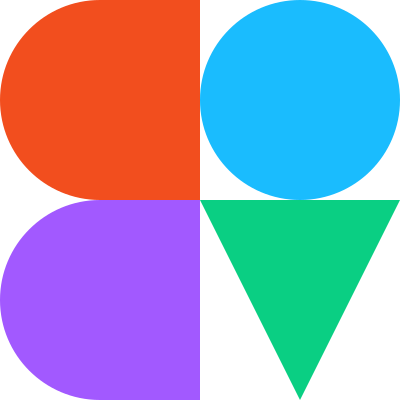

`figma-ds-vue-plugin` is a Vue component library that matches the [UI2: Figma Design System](https://www.figma.com/community/file/928108847914589057) for building Figma plugins. 
It is based on [thomas-lowry/figma-plugin-ds](https://github.com/thomas-lowry/figma-plugin-ds).

## ✨ Installation

1.  Install the package `npm i @ui-kit/figma-ds-vue-plugin`

2.  Include the global stylesheet in your app (either on component-level or make it accessible globally by importing it to your app's entry file, ex: `main.js`)

    `import '@ui-kit/figma-ds-vue-plugin/dist/figma-ds-vue-plugin.css'`

3.  Import and register the Vue components you want to use, look for documentation for details and an overview of all available components

4.  Enjoy building your plugin 💻✨

## 📝 Documentation

Refer to the library's [documentation](/docs) for a detailed overview of each component and its usage.

Quick reference:

-   [Button](docs/components/button/)
-   [Checkbox](docs/components/checkbox/)
-   [Disclosure](docs/components/disclosure/)
-   [Divider](docs/components/divider/)
-   [Icon](docs/components/icon/)
-   [Icon Button](docs/components/icon-button/)
-   [Input](docs/components/input/)
-   [Number Input](docs/components/num-input/)
-   [Radio menu](docs/components/radio-menu/)
-   [Select menu](docs/components/select-menu/)
-   [Label](docs/components/label/)
-   [Text](docs/components/text/)
-   [Textarea](docs/components/textarea/)
-   [Title](docs/components/title/)
-   [Toggle](docs/components/toggle/)
-   [Tooltip](docs/components/tooltip/)

The global stylesheet also includes [style variables](docs/styles/variables/) 🎨 and [utility classes](docs/styles/style-utils/) 🧰 which can be used to format your plugin 🌈

## 🌀 Misc

A great writeup on Figma plugin design & heuristics is [@yuanqing's](https://github.com/yuanqing) **[The UX of Figma plugins](https://uxdesign.cc/the-ux-of-figma-plugins-f4f896f8cf35)** 📚

This project is based on [thomas-lowry/figma-plugin-ds](https://github.com/thomas-lowry/figma-plugin-ds). 
It also includes refactored components of [Morglod/figma-vue-boilerplate](https://github.com/Morglod/figma-vue-boilerplate), 
a project which basically kickstarted the development of this one. S/o to these amazing humans 👋

## 📝 License

[MIT](LICENSE)
